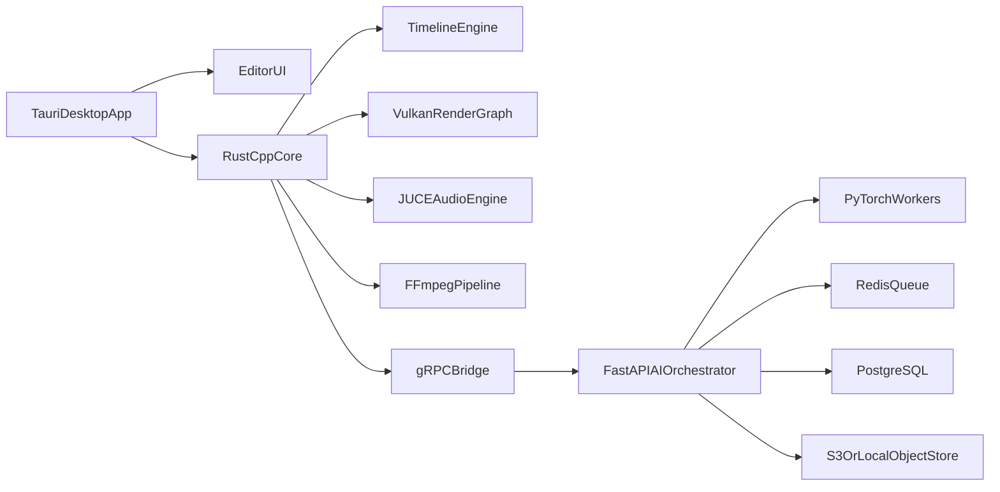

# Renderflow Native Architecture Spec

## Runtime Graph

## No-AI Parity Contract

- Every AI operation resolves to regular project artifacts and timeline edits.
- AI can be disabled per project while preserving full edit and render capabilities.
- Job stages are reviewable and reversible before commit.

## Timing and Sync Math

- Rational timeline time: `t = num / den`
- Frame to time: `t_seconds = frame_index * fps_den / fps_num`
- Time to sample index: `sample = round(t_seconds * sample_rate)`
- Alpha premultiplied composition:
  - `C_out = C_a + C_b * (1 - A_a)`
  - `A_out = A_a + A_b * (1 - A_a)`
