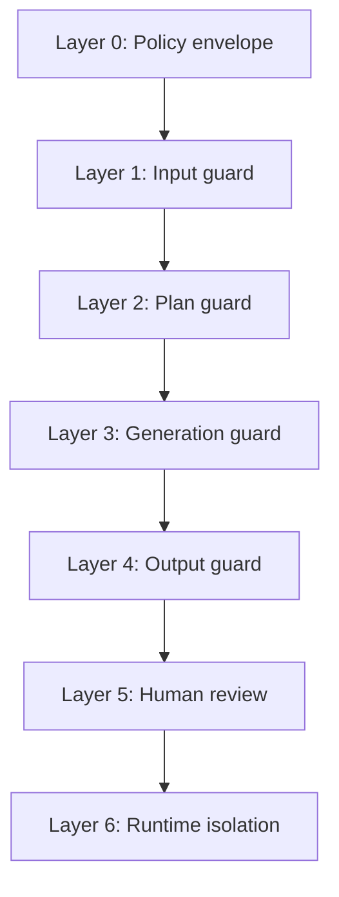

# AI Guardrails — Implementation Plan

**Status:** Draft  
**Last updated:** 2026-06-14  
**Inference engine:** [rfir-inference-engine-design.md](./rfir-inference-engine-design.md)  
**RFIR tasks:** [rfir-inference-engine-implementation.md](./rfir-inference-engine-implementation.md)  
**Onboarding:** [implementer-getting-started-nhuynh30.md](./implementer-getting-started-nhuynh30.md)

---

## 0. Recommended safety & compliance tools

Use industry-standard OSS/commercial tools — not home-grown regex-only moderation.

| Layer | Tool | Notes |
|-------|------|-------|
| Prompt safety classifier | **Meta Llama-Guard-3-1B** | S1–S13 categories; INT4 on CPU via llama-cpp or transformers |
| PII detection | **Microsoft Presidio** | Email, phone, SSN, names; `redact` before audit log |
| Prompt injection | **Rule layer +** optional **Llama Guard** | Strip system tokens; max length |
| Output frame scan | **Llama Guard** + **open NSFW classifier** (e.g. `Falconsai/nsfw_image_detection`) | Sample every 0.5s |
| Face / likeness | **InsightFace** `buffalo_l` | Embedding compare vs org blocklist |
| CSAM hash (opt-in) | **Thorn Safer** or **Microsoft PhotoDNA Cloud** | Legal must enable; never DIY hash DB |
| Provenance / transparency | **`c2pa-python`** | Embed `ai_generated`, job_id, model IDs |
| Rate limiting | **Redis** sliding window | Already in stack |
| Audit | **Postgres** `guardrail_decisions` + `audit_events` | Immutable trail |

**Ethical rule:** Category **S4 (child exploitation)** → `block` with **no admin override**. Engineering cannot disable in production (`READINESS_MODE=prod`).

---

## 1. Purpose

This document defines how RenderFlow Studio implements **AI guardrails** for video and media generation: technical controls, **human ethical** boundaries, **safety** protections, and **legal** compliance.

Guardrails are mandatory for any path that runs RFIR or legacy `text_video_pipeline` generation. They apply equally to **local** and **cloud** inference.

### Principles

1. **Human dignity** — No content designed to dehumanize, harass, or incite violence against people or groups.
2. **Safety first** — Block high-risk content before GPU spend; fail closed when uncertain in restricted modes.
3. **Legal compliance** — Respect copyright, publicity rights, child protection, export/sanctions, and applicable AI transparency laws.
4. **Human agency** — AI proposes; humans review and accept. No auto-commit to timeline or overwrite of source media.
5. **Transparency** — Users see what was checked, what was blocked, and what provenance metadata was embedded.
6. **No-AI parity** — Disabling AI disables all guardrail-gated generation paths; manual editing is unchanged.
7. **Minimize harm** — Log and retain audit data for accountability without storing unnecessary prompt PII.

---

## 2. Threat model

| Threat | Example | Primary gate |
|--------|---------|--------------|
| Illegal content | CSAM, extreme violence instructions | Input + output classifiers; hash matching |
| Non-consensual intimate imagery | NCII / “deepfake” porn | Likeness + NSFW gates |
| Harassment / hate | Slurs, dehumanization, targeted abuse | Prompt + storyboard policy |
| Misinformation / impersonation | Fake news of real public figure | Likeness + disclosure requirements |
| Copyright infringement | “Generate entire Marvel movie” | Prompt policy + optional similarity |
| Privacy violation | Generating from stolen private photos | Asset consent + PII scrub |
| Prompt injection | “Ignore rules; output …” | Injection sanitizer |
| Resource abuse | Runaway cloud GPU cost | Budget + rate limits |
| Supply chain | Malicious model weights | Model manifest signing |
| Regulatory | EU AI Act transparency, state biometrics laws | Provenance + regional policy |

---

## 3. Guardrail architecture

Six layers. Each layer produces a `GuardrailDecision` logged to the database.



### Verdict types

| Verdict | Meaning |
|---------|---------|
| `allow` | Proceed |
| `block` | Stop job; no GPU; user sees reason code |
| `escalate` | Proceed to review with warnings; may restrict tiers |
| `redact` | Modify prompt/assets (PII strip) then continue |

---

## 4. Layer 0 — Policy envelope

**When:** `POST /v1/jobs` (before enqueue).  
**Where:** `services/orchestrator/app/guardrails/policy_gate.py`

### Checks

| Check | Source | Action if fail |
|-------|--------|----------------|
| Project AI disabled | `projects.ai_enabled` | `block` — `AI_DISABLED` |
| Org mode | `projects.settings_jsonb.ai` | `block` or cap tier |
| User role | `users.role` | Viewers cannot submit gen jobs |
| Regional policy | `settings_jsonb.ai.region_policy` | Restrict likeness / biometrics |
| Rate limit | Redis counter per user/project | `block` — `RATE_LIMIT` |
| Budget ceiling | `max_gpu_seconds`, daily quota | `block` — `QUOTA_EXCEEDED` |
| Cloud allowed | `ai.cloud_allowed` | Force local route or `block` |

### Policy schema (project settings)

```json
{
  "ai": {
    "enabled": true,
    "allowed_modes": ["scene", "audio", "video"],
    "max_tier": "C",
    "max_duration_sec": 120,
    "max_resolution": "1920x1080",
    "cloud_allowed": true,
    "local_only": false,
    "require_review": true,
    "likeness_mode": "strict",
    "nsfw_mode": "block",
    "copyright_mode": "warn",
    "region_policy": "default"
  }
}
```

### `nsfw_mode` values

| Mode | Behavior |
|------|----------|
| `block` | No sexual content; default for workplace |
| `restricted` | Allow artistic non-explicit; block explicit |
| `off` | Not recommended; requires org admin + legal sign-off |

### `likeness_mode` values

| Mode | Behavior |
|------|----------|
| `strict` | Block known public figures and uploaded blocklist faces |
| `consent` | Allow only with explicit consent asset linked to job |
| `off` | Admin-only; audit-heavy |

---

## 5. Layer 1 — Input guard

**When:** Job create, before compile/enqueue.  
**Where:** `services/orchestrator/app/guardrails/prompt_guard.py`

### 5.1 Prompt injection sanitizer

- Strip or escape system-like tokens (`ignore previous`, `you are now`, role markers).
- Max prompt length (default 4000 chars).
- Reject nested JSON/tool-call patterns in user text.

### 5.2 Content policy classifier

**Model:** Llama-Guard-3-1B (INT4, CPU) or equivalent OSS safety classifier.

**Categories (align with Meta Llama Guard / industry standard):**

- S1: Violent crimes  
- S2: Non-violent crimes  
- S3: Sex-related crimes  
- S4: Child exploitation (**zero tolerance → block + report workflow**)  
- S5: Defamation  
- S6: Specialized advice (medical/legal/financial) — `escalate` with disclaimer  
- S7: Privacy  
- S8: Intellectual property — `warn` or `block` per `copyright_mode`  
- S9: Indiscriminate weapons  
- S10: Hate speech  
- S11: Self-harm  
- S12: Sexual content — per `nsfw_mode`  
- S13: Elections / civic misinformation — `escalate` or `block` per region  

**Ethical rule:** Categories S4, S9, S10 (targeted), S11 (instructions) → **`block`** in all modes. No admin override for S4.

### 5.3 PII detection

- Regex: email, phone, SSN, credit card, street addresses.
- Optional NER model for names in sensitive contexts.
- Action: `redact` with `[REDACTED]` in stored audit copy; original only if org policy allows and encrypted.

### 5.4 Reference asset checks

If job includes reference images/video:

- Scan with same NSFW / violence classifiers.
- EXIF GPS strip on ingest.
- Consent flag required on asset: `meta_jsonb.consent_for_ai = true` for likeness-sensitive use.

### 5.5 Blocklist / allowlist

- Org-maintained keyword blocklist (slurs, trademarks).
- Optional global hash blocklist (CSAM hashes — see §8.3).

---

## 6. Layer 2 — Plan guard

**When:** After RFIR `plan_shots` / storyboard, before GPU compile.  
**Where:** `services/orchestrator/app/guardrails/plan_guard.py`

### Checks on structured `ShotList`

| Check | Method |
|-------|--------|
| Shot descriptions re-run safety classifier | Per-shot text |
| Disallowed subject detection | “real person X”, minor descriptors |
| Tier cap | Downgrade D→C if policy `max_tier=C` |
| Duration cap | Trim or `block` if total > `max_duration_sec` |
| Camera / scene sanity | Reject plans explicitly depicting illegal acts |

**Escalate** if plan contains borderline political, medical, or financial advocacy — surface warnings in review UI.

---

## 7. Layer 3 — Generation guard

**When:** Between RFIR IR nodes during `running` status.  
**Where:** `services/model-workers/app/guardrails/runtime_guard.py`

### Mid-generation checks

| Checkpoint | Frequency | Action |
|------------|-----------|--------|
| Keyframe NSFW / violence | After each `t2i_keyframe` batch | `block` job; discard tensors |
| Child-present heuristic | After keyframes | `block` if adult+minor risk combo |
| Frame sampler | Every Nth frame Tier B/C | Pause → `escalate` if drift into blocked class |
| GPU budget | Each node | Downgrade via budget governor (RFIR) |
| Hard abort | User cancel | Existing `cancel_job` |

Worker **must not** persist keyframes that failed generation guard to long-term storage; delete blob URIs on `block`.

---

## 8. Layer 4 — Output guard

**When:** After all stages, before `JobStatus.REVIEW`.  
**Where:** `services/orchestrator/app/guardrails/output_guard.py`

### 8.1 Video / image scan

- Sample frames (every 0.5s + scene boundaries).
- NSFW, violence, gore classifiers on downscaled frames.
- Aggregate score → `allow` / `escalate` / `block`.

### 8.2 Likeness / impersonation

- Face embedding compare vs org blocklist (public figures, opted-out talent).
- If `likeness_mode=consent`, require matching consent asset embedding.
- **Ethical default:** block synthetic intimate imagery of real identifiable people.

### 8.3 CSAM / illegal content (legal)

- PhotoDNA-style hash matching where legally available and licensed.
- Match against NCMEC-compatible hash lists if org enables (`settings_jsonb.ai.csam_hash_check=true`).
- On positive match: **`block`**, do not return media to client, follow **§12 Incident response**.

### 8.4 Copyright signals

- Per `copyright_mode`:
  - `block`: high similarity to known copyrighted reference sets → block.
  - `warn`: allow review with watermark warning.
  - `off`: log only (not recommended for SaaS).

### 8.5 Provenance metadata (legal transparency)

Embed before review:

- **C2PA** manifest or lightweight JSON sidecar:
  - `generator`: `Deepiri RenderFlow RFIR`
  - `job_id`, `model_manifest_ids`, `timestamp`
  - `ai_generated: true`
  - Optional: visible disclosure watermark (org setting).

Supports EU AI Act Art. 50 transparency expectations for synthetic media.

### 8.6 Audio (if voice pipeline)

- Block cloning of non-consent voices.
- TTS only from licensed voice catalog unless user uploaded consent voice model.

---

## 9. Layer 5 — Human review

**Existing:** `POST /v1/jobs/{id}/accept` and `reject` in `ai_jobs.py`.

### Enhancements

- [ ] Review payload includes `guardrail_summary` (gates passed, warnings, downgrades).
- [ ] **Reject** deletes output blobs from object store (not only DB status).
- [ ] **Accept** never overwrites source clips — new `asset_versions` row only.
- [ ] Optional second reviewer for `escalate` jobs in enterprise mode.
- [ ] `require_review: true` cannot be disabled in cloud SaaS default tier.

### Review UI copy (ethical transparency)

Show users:

- “This output is AI-generated.”
- Which models were used.
- Any policy warnings (copyright, likeness, restricted content).
- How to report a problem.

---

## 10. Layer 6 — Runtime isolation

| Control | Implementation |
|---------|----------------|
| Sandboxed workers | Container: no arbitrary outbound network |
| No arbitrary ComfyUI graphs | Only compiled RFIR IR ops from allowlist |
| Model integrity | SHA256 in `models/registry.py`; verify on load |
| Secrets | No API keys in prompts logged to audit |
| Tauri FS scope | AI artifacts only under project root |
| Cloud data residency | `region_policy` selects storage + worker region |

---

## 11. Data model

### Migration: `006_guardrails.sql`

```sql
create table if not exists guardrail_decisions (
  id uuid primary key default gen_random_uuid(),
  job_id uuid references ai_jobs(id) on delete cascade,
  gate text not null,           -- policy | prompt | plan | generation | output
  verdict text not null,        -- allow | block | escalate | redact
  reason_code text,             -- e.g. CSAM_SUSPECT, NSFW_BLOCK, RATE_LIMIT
  score double precision,
  details_jsonb jsonb not null default '{}',
  created_at timestamptz not null default now()
);

create index if not exists idx_guardrail_job on guardrail_decisions(job_id);
create index if not exists idx_guardrail_verdict on guardrail_decisions(verdict);

-- Optional: consent records for likeness
create table if not exists ai_consent_records (
  id uuid primary key default gen_random_uuid(),
  project_id uuid not null references projects(id) on delete cascade,
  subject_label text not null,
  asset_id uuid references assets(id),
  granted_by uuid references users(id),
  scope text not null default 'likeness',
  expires_at timestamptz,
  created_at timestamptz not null default now()
);
```

### Audit integration

Continue using `audit_events` for high-level events:

- `ai.job.blocked`
- `ai.job.escalated`
- `ai.job.accepted`
- `ai.job.rejected`
- `ai.guardrail.incident`

`db_repos.audit_log()` for each `block` and `incident`.

---

## 12. Legal and ethical compliance matrix

| Requirement | RenderFlow control |
|-------------|-------------------|
| **Child safety (US COPPA, EU DSA, global)** | S4 zero tolerance; age-appropriate defaults; no minor sexualization |
| **NCII / deepfake porn laws (US state, UK, EU)** | Likeness guard + block intimate imagery of real people without consent |
| **Publicity / personality rights** | `likeness_mode`, consent records, blocklist |
| **Copyright** | Prompt policy, `copyright_mode`, user ToS acknowledgment |
| **GDPR / privacy** | PII redaction, data minimization in logs, regional storage |
| **EU AI Act (transparency)** | C2PA / metadata, disclosure in UI |
| **US state AI election laws** | Escalate/block synthetic political content per `region_policy` |
| **Accessibility of appeals** | User can appeal `block` with human support ticket; audit trail |
| **Bias / fairness** | Periodic eval of classifier false positives across demographics; document in release notes |
| **Sanctions / export** | Cloud region restrictions (infra policy, not model) |

### Terms of Service (product/legal team)

Engineering implements technical controls; legal owns:

- [ ] User ToS: prohibited uses list mirroring S1–S13.
- [ ] Privacy policy: prompt logging, retention, deletion.
- [ ] DMCA / copyright takedown process.
- [ ] Law enforcement request policy.

---

## 13. Repository layout

```
services/orchestrator/
  app/guardrails/
    __init__.py
    types.py              # GuardrailDecision, ReasonCode enum
    policy_gate.py        # Layer 0
    prompt_guard.py       # Layer 1
    plan_guard.py         # Layer 2
    output_guard.py       # Layer 4
    pii.py
    blocklist.py
    provenance.py         # C2PA / sidecar
    classifier.py         # Llama-Guard wrapper
    config.py             # Thresholds from Settings
  tests/
    test_policy_gate.py
    test_prompt_injection.py
    test_prompt_classifier.py
    test_plan_guard.py
    test_output_guard.py
    fixtures/benign_prompts.jsonl
    fixtures/blocked_prompts.jsonl

services/model-workers/
  app/guardrails/
    __init__.py
    runtime_guard.py      # Layer 3

infra/postgres/migrations/
  006_guardrails.sql
```

---

## 14. API integration

### Job create (`ai_jobs.py`)

```python
def create_ai_job(payload: AiJobCreate) -> AiJobOut:
    decision = policy_gate.check(payload)
    if decision.verdict == "block":
        raise HTTPException(403, detail=decision.reason_code)
    prompt_decision = prompt_guard.check(payload.prompt, payload.project_id)
    ...
    job = store.create(...)
    guardrail_repo.insert_decisions(job.id, [decision, prompt_decision])
    enqueue_job(str(job.id), get_settings())  # only if allow
```

### Redis payload

```json
{
  "guardrail_verdict": "allow",
  "guardrail_flags": ["copyright_warn"],
  "max_tier": "C"
}
```

Worker aborts if `guardrail_verdict != "allow"`.

### Job response schema extension

Add to `AiJobOut` / metadata:

```json
{
  "guardrail_summary": {
    "verdict": "escalate",
    "warnings": ["COPYRIGHT_SIMILARITY"],
    "blocked_shots": []
  }
}
```

---

## 15. Implementation phases

### Phase G0 — Schema and types (Week 1)

- [ ] **G0.1** Migration `006_guardrails.sql`
- [ ] **G0.2** `guardrails/types.py` — `GuardrailDecision`, `ReasonCode` enum
- [ ] **G0.3** `db_repos.insert_guardrail_decision()`
- [ ] **G0.4** Unit tests for types and DB insert

**Exit:** Migration applies; decisions persist.

### Phase G1 — Policy + prompt gates (Week 2)

- [ ] **G1.1** `policy_gate.py` — `ai_enabled`, rate limit, quota, cloud/local
- [ ] **G1.2** `prompt_guard.py` — injection sanitizer, length, blocklist
- [ ] **G1.3** `classifier.py` — Llama-Guard-3-1B loader (CPU INT4)
- [ ] **G1.4** Wire `create_ai_job` — block before enqueue
- [ ] **G1.5** Tests: `test_prompt_injection.py`, `test_policy_gate.py`, classifier fixtures

**Exit:** Malicious prompts in `blocked_prompts.jsonl` → 403; benign set passes.

### Phase G2 — Plan and runtime gates (Week 3)

- [ ] **G2.1** `plan_guard.py` — shot list classifier pass
- [ ] **G2.2** Hook after `plan_shots` in RFIR compile path
- [ ] **G2.3** `model-workers/.../runtime_guard.py` — keyframe scan
- [ ] **G2.4** Integrate RFIR executor checkpoints (implementation doc §1.16, §3)

**Exit:** Blocked plan never allocates GPU; failed keyframe batch aborts job.

### Phase G3 — Output guard + provenance (Week 4)

- [ ] **G3.1** `output_guard.py` — frame sampler + classifiers
- [ ] **G3.2** `provenance.py` — C2PA or JSON sidecar on output MP4
- [ ] **G3.3** Run before `JobStatus.REVIEW` in `worker_loop`
- [ ] **G3.4** `reject` deletes blobs; verify in test
- [ ] **G3.5** `guardrail_summary` in job GET response

**Exit:** Review only sees outputs that passed output guard or `escalate`.

### Phase G4 — Likeness, consent, legal hardening (Week 5)

- [ ] **G4.1** `ai_consent_records` CRUD API (internal)
- [ ] **G4.2** Face embedding blocklist (opt-in org feature)
- [ ] **G4.3** CSAM hash check hook (org-flagged; legal review before enable)
- [ ] **G4.4** `region_policy` presets: `eu`, `us_default`, `strict`
- [ ] **G4.5** Incident response runbook (§16) linked from ops docs

**Exit:** Legal sign-off checklist completed for SaaS beta.

### Phase G5 — Monitoring and fairness (Week 6)

- [ ] **G5.1** Dashboard: block rate by `reason_code`, false positive reports
- [ ] **G5.2** Quarterly classifier eval on diverse prompt set
- [ ] **G5.3** User appeal flow (support ticket + audit link)
- [ ] **G5.4** Document retention: 90-day default for prompt audit; configurable

---

## 16. Incident response

### CSAM or illegal content suspect

1. **Block** delivery to user immediately.
2. Do **not** include media in support exports.
3. Preserve `guardrail_decisions` + minimal metadata per legal counsel guidance.
4. Report via org’s NCMEC / regional process if legally required.
5. Rotate storage credentials if compromise suspected.

### Classifier false positive

1. User appeals via support.
2. Operator reviews audit log (not blocked media if never stored).
3. Optional org allowlist phrase after human review.
4. Feed into quarterly eval set.

---

## 17. Configuration

| Variable | Default | Description |
|----------|---------|-------------|
| `RENDERFLOW_GUARDRAILS_ENABLED` | `true` | Master switch (dev only `false` with env ack) |
| `RENDERFLOW_GUARDRAIL_CLASSIFIER` | `llama-guard-3-1b` | Safety model id |
| `RENDERFLOW_GUARDRAIL_NSFW_MODE` | `block` | Project override wins |
| `RENDERFLOW_GUARDRAIL_RATE_LIMIT` | `20/hour/user` | Redis |
| `RENDERFLOW_GUARDRAIL_LOG_PROMPTS` | `true` | If false, log hash only |
| `RENDERFLOW_GUARDRAIL_CSAM_HASH` | `false` | Requires legal enable |
| `RENDERFLOW_GUARDRAIL_PROVENANCE` | `c2pa` | `c2pa` \| `json` \| `off` |

**Production rule:** `RENDERFLOW_GUARDRAILS_ENABLED=false` requires `READINESS_MODE=dev` and logs a critical warning.

---

## 18. Reason codes (user-visible subset)

| Code | User message (plain language) |
|------|-------------------------------|
| `AI_DISABLED` | AI is turned off for this project. |
| `RATE_LIMIT` | Too many AI requests; try again later. |
| `POLICY_BLOCK` | This request isn’t allowed under your organization’s rules. |
| `SAFETY_BLOCK` | This prompt was flagged for safety reasons. |
| `COPYRIGHT_WARN` | This may resemble copyrighted work; review carefully. |
| `LIKENESS_BLOCK` | Real-person likeness restrictions apply. |
| `CONSENT_REQUIRED` | Link a consent record for this subject. |
| `OUTPUT_BLOCK` | Generated output didn’t pass safety checks. |
| `QUOTA_EXCEEDED` | GPU time quota used for this period. |

Do not expose internal classifier scores or hash match details to end users.

---

## 19. Testing and ethics QA

| Test type | Content |
|-----------|---------|
| Unit | Injection, PII redaction, policy matrix |
| Fixture | `benign_prompts.jsonl` — false positive rate < 2% |
| Fixture | `blocked_prompts.jsonl` — recall > 95% on critical categories |
| Integration | Job blocked before Redis enqueue |
| Integration | Output guard blocks before review |
| Manual | Red team quarterly (outside eng) |

**Human ethics review:** Product + legal sign-off on category mapping before GA.

---

## 20. Definition of done (guardrails v1)

- [ ] All six layers implemented for RFIR path.
- [ ] S4 (child exploitation) blocks with no override.
- [ ] Human review required before accept (unchanged).
- [ ] Reject deletes generated blobs.
- [ ] Provenance metadata on all AI video outputs.
- [ ] `guardrail_decisions` + `audit_events` for blocks.
- [ ] ToS / privacy docs referenced in UI (legal team).
- [ ] No-AI mode bypasses all layers without affecting manual edit.
- [ ] RFIR worker refuses jobs with `guardrail_verdict != allow`.

---

## 21. Document history

| Date | Change |
|------|--------|
| 2026-06-14 | Initial guardrails implementation plan (ethics, safety, legal) |
