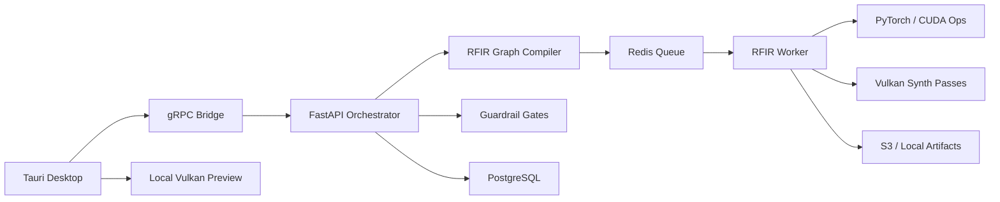
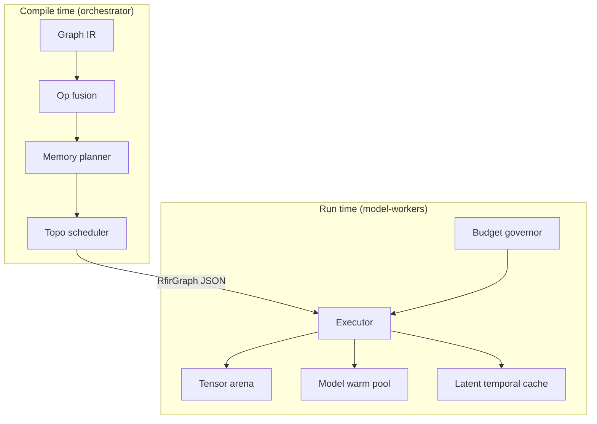

# RFIR Inference Engine — Design Specification

**Status:** Draft  
**Last updated:** 2026-06-14  
**Owners:** RenderFlow AI / model-workers  
**Related:** [architecture.md](./architecture.md), [module-boundaries.md](./module-boundaries.md), [guardrails-implementation.md](./guardrails-implementation.md)

---

## 1. Purpose

This document defines the **RenderFlow Inference Runtime (RFIR)** and the **Compositor-First Sparse Video (CFSV)** strategy for cost-effective AI video generation inside Deepiri Renderflow Studio.

RFIR is not a ComfyUI wrapper or a single quantized T2V model. It is a **compiled execution engine** that:

1. Plans shots from a text prompt (structured JSON, not raw diffusion).
2. Routes each shot to a **cost tier** (A/B/C/D).
3. Runs **sparse generative inference** only where the Vulkan compositor and timeline cannot synthesize pixels cheaply.
4. Stitches results through the existing **FFmpeg + Vulkan** media path into reviewable job artifacts.

### Goals

| Goal | Target |
|------|--------|
| Cost per 60s 1080p video (cloud) | < $0.20 |
| Local preview (first Tier-A shot) | < 8s on RTX 4060 |
| No-AI parity | AI path produces normal assets; disabling AI removes copilot only |
| Hybrid deployment | Local GPU + optional cloud burst |
| Human review | All outputs land in `review` before timeline commit |

### Non-goals (v1)

- Real-time interactive diffusion in the program monitor.
- Replacing the native Vulkan NLE compositor for editorial work.
- Training or fine-tuning models inside RenderFlow.
- Autonomous timeline commits without user accept.

---

## 2. Problem statement

### 2.1 Why full T2V is too expensive

State-of-the-art text-to-video (T2V) diffuses a latent tensor for **every frame**:

```
GPU-sec ∝ T × H' × W' × N_steps × N_layers
```

For 5 seconds at 24 fps, 1080p, ~30 steps on a 2B DiT: **45–90 GPU-seconds** per clip on mid-range cloud GPUs ($0.50–2.00 per short clip at spot rates).

RenderFlow is already a **native editor** with:

- Vulkan render graph (`core/render-engine-vulkan`)
- Rational timeline (`core/timeline-engine-rs`)
- Staged AI jobs with human review (`services/orchestrator`)
- Hybrid local/cloud workers (`services/model-workers`)

The cost advantage comes from **not diffusing pixels the editor can produce natively**.

### 2.2 CFSV thesis

> Generate only what the compositor cannot synthesize cheaply.

Most editorial “AI video” is: subject + background + camera motion + cuts. That is achievable with **keyframes + depth + native motion**, not 100% frame-wise diffusion.

```
Video = Compose( SparseGenerate(prompt), NativeMotion(camera, depth) )
```

---

## 3. System context

### 3.1 Runtime graph (extended)



### 3.2 Responsibility split

| Component | Location | Role |
|-----------|----------|------|
| Shot planner | `services/orchestrator` | Prompt → structured `ShotList` |
| Tier router | `services/orchestrator` or `model-workers` | Assign tier per shot |
| Graph compiler | `services/orchestrator` | `ShotList` → `RfirGraph` JSON |
| Graph executor | `services/model-workers/app/rfir` | Run compiled graph on GPU |
| Vulkan synth | `core/render-engine-vulkan/src/synth` | Parallax, upscale, composite |
| Artifact mux | `services/orchestrator/app/media` | FFmpeg final output |
| Review gate | `services/orchestrator/app/api/routers/ai_jobs.py` | accept / reject |

See [module-boundaries.md](./module-boundaries.md) for import and packaging rules.

---

## 4. CFSV tier model

Each storyboard shot receives exactly one tier at compile time. Tiers may be **downgraded at runtime** by the budget governor; upgrades require budget headroom and policy allowance.

| Tier | Share (typical) | Technique | Relative GPU cost |
|------|-----------------|-----------|-------------------|
| **A** | ~70% | 1× T2I keyframe + depth + Vulkan parallax / Ken Burns | 1× |
| **B** | ~20% | 2–4 keyframes + RIFE / FILM interpolation | ~5× |
| **C** | ~8% | Sparse T2V on **ROI crop** (subject mask), composited over Tier-A plate | ~15× |
| **D** | ~2% | Full-frame T2V, short duration, hero shots only | ~50× |

### 4.1 Tier A — Keyframe + native motion

**When:** Static or slow camera, single subject, no complex deformation.

```
prompt → t2i_keyframe → depth_estimate → vulkan_parallax → vulkan_upscale
```

Camera motion is **parsed from the shot plan** (dolly, pan, orbit), not learned. Depth drives 2.5D parallax in Vulkan.

### 4.2 Tier B — Keyframe interpolation

**When:** Moderate motion, walking, pose change between endpoints.

```
t2i_keyframe(start) + t2i_keyframe(end) [batched]
  → depth (both)
  → rife_interpolate
  → optional vulkan_motion_blur
  → vulkan_upscale
```

**Quality gate:** SSIM between RIFE midpoint and a verification keyframe. If below threshold → selective escalation to Tier C for that segment only.

### 4.3 Tier C — Sparse ROI diffusion

**When:** Complex subject motion (hair, liquid, fast limbs) in a bounded region.

```
t2i_keyframe → segment_subject → vae_encode
  → sparse_t2v_window (LTC, ROI mask)
  → vae_decode (ROI)
  → vulkan_composite over Tier-A background plate
```

Background plate is generated cheaply at Tier A first; diffusion runs on ~25–35% of pixels.

### 4.4 Tier D — Full-frame hero

**When:** Establishing shots, crowds, water, or explicit user “quality mode.”

```
sparse_t2v_window (full frame) → vulkan_upscale
```

Hard caps: max duration per shot (v1: 3s), requires policy `max_tier >= D`, budget headroom.

---

## 5. RFIR architecture

RFIR has five subsystems:



### 5.1 Graph IR

Static intermediate representation. Compiled once per job; executed with minimal Python per-op overhead.

**Node:**

```python
@dataclass(frozen=True)
class RfirNode:
    id: str
    op: str                    # e.g. "t2i_keyframe", "sparse_t2v_window"
    inputs: dict[str, str]     # port → tensor_id or literal key
    outputs: dict[str, str]
    attrs: dict[str, Any]      # steps, seed, tier, roi, camera_path, ...
    estimated_gpu_ms: float
    vram_mb: int
```

**Graph:**

```python
@dataclass
class RfirGraph:
    nodes: list[RfirNode]
    tensors: dict[str, TensorSpec]
    metadata: JobMetadata       # fps, resolution, job_id, project_id
```

**Tensor spec:**

```python
@dataclass
class TensorSpec:
    dtype: str       # latent_f16 | rgb_u8 | depth_f32 | flow_f32 | mask_u8
    shape: tuple[int, ...]
    lifetime: str    # shot | job | scratch
    device: str      # cuda:0 | cpu | vulkan
```

### 5.2 Op catalog

| Op | Device | Purpose |
|----|--------|---------|
| `plan_shots` | CPU | Prompt → `ShotList` JSON |
| `t2i_keyframe` | CUDA | Keyframe image generation |
| `depth_estimate` | CUDA | Depth map for parallax |
| `segment_subject` | CUDA | Subject mask (ROI) |
| `vae_encode` | CUDA | RGB → latent |
| `sparse_t2v_window` | CUDA | Windowed sparse diffusion |
| `vae_decode` | CUDA | Latent → RGB |
| `rife_interpolate` | CUDA | Tier B frame interpolation |
| `vulkan_parallax` | Vulkan | 2.5D motion from depth + camera |
| `vulkan_upscale` | Vulkan | Resolution recovery (e.g. 512→1080) |
| `vulkan_composite` | Vulkan | Layer stack, premultiplied alpha |
| `vulkan_motion_blur` | Vulkan | Optional post |
| `ffmpeg_mux` | CPU | Video + audio → container |

### 5.3 Compiler passes

1. **Build** — one subgraph per shot from `ShotList`.
2. **Fusion** — batch compatible `t2i_keyframe` nodes; share `vae_encode` where possible.
3. **Memory plan** — liveness analysis → `peak_vram_mb`; spill / chunk / downgrade if over budget.
4. **Schedule** — topological sort; insert CUDA↔Vulkan barriers.
5. **Serialize** — `RfirGraph` → JSON URI in job payload.

### 5.4 Tensor arena

Bump allocator + slab reuse for known shapes. Avoids PyTorch alloc churn across shots.

- **Compile-time:** peak VRAM estimate from tensor liveness.
- **Run-time:** `release_shot(shot_id)` recycles scratch; shot tensors freed at shot boundary.
- **Spill transforms:** decode latents early; run T2V in smaller windows; downgrade tier.

### 5.5 Latent Temporal Cache (LTC)

Novel optimization for Tier C/D windowed diffusion.

**Cache entry per shot:**

- Last-frame latent `z_{t-1}`
- Frozen text embedding
- Motion vector summary (optical flow)
- Optional DiT KV state (if model supports)

**Sliding window:**

- `window_size = 16`, `overlap = 4`, `step = 12`
- Condition each window on flow-warped previous latent: `z'_0 = Warp(z_{t-1}, F)`
- Cosine blend in overlap region
- ~35% fewer effective steps vs cold windows; fewer temporal seams

### 5.6 Model warm pool

LRU pool with **pinned** shared weights per job:

| Pinned for job lifetime | Loaded on demand |
|-------------------------|------------------|
| VAE, text encoder | T2I, depth, RIFE, T2V |

Shot ordering minimizes load/evict: all Tier-A backgrounds → Tier-B → Tier-C/D.

### 5.7 Budget governor

Every graph carries `InferenceBudget`:

```python
@dataclass
class InferenceBudget:
    max_gpu_seconds: float = 120.0
    max_tier: str = "C"          # A < B < C < D
    spent_gpu_seconds: float = 0.0
    escalations_allowed: int = 2
```

Before each node: if projected spend > 85% budget → apply downgrade template (C→B, B→A, fewer steps). Downgrades recorded in job metrics for review UI.

### 5.8 Checkpointing

Checkpoint at **shot boundaries** for spot GPU survival:

- `shot_index`, LTC state, arena manifest (tensor URIs), `spent_gpu_seconds`, node cursor
- Resume via `REDIS_KEY_JOBS_RETRY` (existing queue contract)

---

## 6. Recommended toolchain & model stack (v1)

RenderFlow RFIR uses **best-in-class OSS tools** that integrate with our existing Poetry / PyTorch / Vulkan / Redis stack. We deliberately **do not** build on ComfyUI or proprietary video APIs as the primary runtime — RFIR compiles a static IR and calls libraries directly for predictable cost and guardrail hooks.

**Implementer onboarding:** [implementer-getting-started-nhuynh30.md](./implementer-getting-started-nhuynh30.md)

### 6.1 Runtime & framework choices

| Layer | Tool | Why (vs alternatives) |
|-------|------|------------------------|
| Diffusion inference | **[Hugging Face `diffusers`](https://github.com/huggingface/diffusers)** | Native FLUX, CogVideoX, Wan pipelines; production-maintained; no ComfyUI graph overhead |
| Tensor ops | **PyTorch 2.x** + **`torch.compile`** | Already in `model-workers`; compile hot paths (T2I batch, RIFE) |
| LLM planner (CPU) | **`llama-cpp-python`** + GGUF | Low RAM on dev laptops; no GPU required for planning |
| LLM planner (GPU opt.) | **[vLLM](https://github.com/vllm-project/vllm)** | Optional cloud path for high-throughput shot planning |
| Quantization | **`autoawq`** / **`bitsandbytes`** NF4 | AWQ for FLUX; NF4 for Wan/CogVideoX on 8 GB cards |
| GPU selection | **`deepiri-gpu-utils`** (Poetry dep) | Already mandated in [module-boundaries.md](./module-boundaries.md) |
| Frame interpolation | **[RIFE](https://github.com/hzwer/Practical-RIFE)** (Practical-RIFE) | Faster and more stable than FILM for Tier B; OSS |
| Optical flow (LTC) | **RAFT-small** via `torchvision` or lightweight port | Conditions latent windows; cheaper than extra DiT steps |
| Depth | **Depth Anything V2** (`depth-anything/Depth-Anything-V2-Small`) | SOTA monocular depth; small variant fits 8 GB builds |
| Segmentation | **[SAM 2](https://github.com/facebookresearch/sam2)** `sam2-hiera-tiny` | Best ROI masks for Tier C; tiny variant for speed |
| Media I/O | **FFmpeg** (existing `app/media/ffmpeg.py`) | Industry standard mux/decode |
| Native motion / comp | **`render-engine-vulkan`** (`ash`) | Zero ML VRAM; our compositor moat |
| Job queue | **`renderflow_queue`** (Redis) | Already shared orchestrator ↔ workers |
| Object store | **MinIO / S3** (`infra/docker`) | Artifact URIs for graphs and checkpoints |
| Provenance | **[`c2pa-python`](https://pypi.org/project/c2pa-python/)** | Official C2PA SDK; EU AI Act transparency |
| PII scrub | **[Microsoft Presidio](https://github.com/microsoft/presidio)** | Best OSS NER/regex PII pipeline for prompts |

**Explicitly not primary:** ComfyUI (dynamic graphs, hard to guardrail), Runway/Pika APIs (cost, no local), raw `subprocess` to mystery CLIs (current `sdxl` stub).

### 6.2 Model manifest (v1 defaults)

All weights are OSS. Pin hashes in `models/registry.py`. Download via `scripts/download_rfir_models.sh` (to be added).

| Role | Model | Runtime | Quantization | VRAM |
|------|-------|---------|--------------|------|
| Shot planner | **Qwen2.5-3B-Instruct** | llama-cpp / vLLM | GGUF Q4_K_M | ~2 GB RAM |
| Plan JSON schema | **Outlines** or **instructor** + Pydantic | CPU | — | Validates `ShotList` shape |
| Safety (input/plan) | **Llama-Guard-3-1B** | transformers / llama-cpp | INT4 | ~1 GB |
| Keyframes (Tier A/B) | **FLUX.1-schnell** | diffusers | AWQ INT4 | 6–8 GB |
| Keyframes (fallback) | **SDXL-Turbo** | diffusers | FP16 | 6 GB |
| Depth | **Depth-Anything-V2-Small** | transformers | FP16 | ~1 GB |
| ROI mask (Tier C) | **sam2-hiera-tiny** | sam2 | FP16 | ~1–2 GB |
| Sparse video (primary) | **Wan2.1-T2V-1.3B** | diffusers (when available) / official Wan repo | NF4 | 8–10 GB |
| Sparse video (fallback) | **CogVideoX-2b** | diffusers | NF4 / GPTQ | 8–12 GB |
| Interpolation (Tier B) | **RIFE v4.26** | Practical-RIFE | FP16 | ~2 GB |
| Flow warp (LTC) | **RAFT-small** | torchvision | FP16 | ~0.5 GB |
| Upscale / motion | **Vulkan compute** | `render-engine-vulkan` | — | 0 ML VRAM |
| Optional polish | **Real-ESRGAN x2** (Tier D only) | ncnn-vulkan or torch | INT8 | Budget-gated |

**Wan2.1 vs CogVideoX:** Prefer **Wan2.1-1.3B** as primary sparse T2V — better motion quality per GPU-second at 1.3B scale. Keep CogVideoX-2B as manifest fallback if Wan pipeline is unavailable on target CUDA version.

### 6.3 Acceleration ladder (apply in order)

1. **`torch.compile`** on `t2i_keyframe` and `rife_interpolate` (fixed shape buckets).
2. **CUDA Graphs** capture steady-state Tier-A batch after warm-up.
3. **Batch fusion** at compile time (compiler pass — not runtime guesswork).
4. **TensorRT** (optional Phase 5): VAE decode + depth only — diminishing returns on DiT.
5. **FP8** on Ada/Hopper (RTX 40xx, H100) for FLUX when `deepiri-gpu-utils` reports capability.

Precision resolved per device via `deepiri-gpu-utils` + `PrecisionPolicy` (`balanced` | `conservative` | `aggressive`).

### 6.4 Cloud GPU matrix (spot instances)

| Tier work | Minimum GPU | Recommended |
|-----------|-------------|-------------|
| A + B only | RTX 4060 8 GB | RTX 4070 Ti |
| A + B + C | RTX 4090 24 GB | L4 24 GB |
| D hero shots | A10 24 GB | L40S |

Use spot/preemptible + RFIR shot-boundary checkpoints (§5.8).

---

## 7. Vulkan synthesis integration

CFSV depends on native synthesis in `render-engine-vulkan`.

### 7.1 New pass types

Extend `FrameGraph` / `FramePassType::Compute`:

| Pass | Input | Output |
|------|-------|--------|
| `depth_warp` | RGB, depth, camera delta | Warped RGB |
| `parallax` | RGB, depth, `CameraPath` | Frame sequence |
| `upscale_compute` | Low-res RGB | Target resolution RGB |
| `composite_layers` | Layer stack | Composited RGB |

Premultiplied alpha composition follows [architecture.md](./architecture.md):

- `C_out = C_a + C_b * (1 - A_a)`
- `A_out = A_a + A_b * (1 - A_a)`

### 7.2 CUDA ↔ Vulkan handoff

**Preferred:** Linux Vulkan-CUDA external memory (zero-copy `VkImage` → torch tensor).

**Fallback:** Pinned host DMA (~2 ms for 512×288 RGBA).

IR compiler inserts explicit barrier nodes between CUDA ops and Vulkan ops.

### 7.3 Deployment modes

| Mode | Where Vulkan runs |
|------|-------------------|
| Desktop | In-process via Tauri `render_graph_schedule` |
| Cloud worker | Headless EGL/Vulkan sidecar on same host as RFIR worker |

---

## 8. Job lifecycle mapping

Maps to existing `VIDEO_STAGES` in `text_video_pipeline.py` and `worker_loop.py` statuses.

| Job status | RFIR activity |
|------------|---------------|
| `queued` | Graph compiled; payload on Redis |
| `preparing` | Worker loads pinned models |
| `running` | Executor walks IR nodes; SSE per node or stage |
| `review` | Output guard passed; artifacts in store |
| `accepted` / `rejected` | User decision (existing `ai_jobs` routes) |

| VIDEO_STAGE | RFIR phase |
|-------------|------------|
| `script_generation` | `plan_shots` |
| `storyboard` | Tier assignment |
| `asset_generation` | Batched `t2i_keyframe`, `depth` |
| `scene_composition` | `vulkan_parallax`, `vulkan_composite` |
| `animation` | `rife_interpolate`, `sparse_t2v_window` |
| `effects` | Vulkan post passes |
| `color_grade` | Vulkan color / timeline hook |
| `final_render` | `ffmpeg_mux` |

---

## 9. Redis job payload contract

Extend existing payload (see `lib/renderflow_queue/renderflow_queue/redis_ai_jobs.py`):

```json
{
  "job_id": "uuid",
  "payload": {
    "prompt": "user prompt",
    "compiled_graph_uri": "s3://bucket/jobs/{id}/graph.json",
    "shot_list_uri": "s3://bucket/jobs/{id}/shots.json",
    "budget": {
      "max_gpu_seconds": 90.0,
      "max_tier": "C"
    },
    "project": {
      "fps_num": 24,
      "fps_den": 1,
      "resolution_w": 1920,
      "resolution_h": 1080
    },
    "policy": {
      "cloud_allowed": true,
      "local_only": false
    }
  }
}
```

Orchestrator compiles before enqueue; worker is a stateless executor (horizontal scale).

---

## 10. Hybrid routing

| Condition | Route |
|-----------|-------|
| Tier A/B, local GPU ≥ 8 GB | `model-workers` on desktop / LAN |
| Tier C/D or insufficient VRAM | Cloud spot worker |
| `policy.local_only = true` | Cap at Tier B; queue or fail with clear error |
| `policy.cloud_allowed = false` | No upload of prompts/assets to cloud |

Device selection via `deepiri-gpu-utils`; queue priority via `JobPriority.HIGH` for interactive preview jobs.

---

## 11. Quality controls (in-engine)

Distinct from policy guardrails (see [guardrails-implementation.md](./guardrails-implementation.md)).

| Check | Trigger | Action |
|-------|---------|--------|
| Aesthetic score (CLIP-based) | After keyframe | Regenerate up to 3× |
| SSIM (RIFE vs midpoint keyframe) | After Tier B | Escalate segment to Tier C |
| Temporal flicker (frame diff variance) | After Tier C window | Increase overlap; +2 steps |
| Face consistency (optional) | Tier D | Re-seed up to 3× |

---

## 12. Observability

Per-node metrics logged to job metadata:

```json
{
  "total_gpu_seconds": 14.2,
  "tier_distribution": {"A": 8, "B": 2, "C": 1, "D": 0},
  "downgrades": [{"shot": 3, "from": "C", "to": "B", "reason": "budget"}],
  "cost_estimate_usd": 0.11,
  "nodes": [
    {"id": "n_12", "op": "t2i_keyframe", "gpu_ms": 820, "vram_peak_mb": 6144}
  ]
}
```

Stored in `ai_job` metadata and/or `render_jobs.metrics_jsonb` pattern.

---

## 13. Success metrics

| Metric | Target (v1) |
|--------|-------------|
| Cloud cost per 60s 1080p | < $0.20 |
| Tier A share (no complaint) | > 65% |
| Time to first Tier-A preview | < 8s (RTX 4060) |
| Review acceptance rate | > 70% |
| Spot resume success | > 95% after checkpoint |
| Guardrail block rate (false positive) | < 2% on benign creative prompts |

---

## 14. Risks and mitigations

| Risk | Mitigation |
|------|------------|
| Tier B motion artifacts | SSIM gate + selective Tier C escalation |
| VRAM OOM on 8 GB GPUs | Memory planner + tier downgrade |
| Vulkan unavailable in cloud | FFmpeg motion fallback for Tier A |
| Model license drift | Pinned manifests in `models/registry.py` |
| Temporal seams in Tier C | LTC + overlap blend + flow warp |
| Legal/safety content | Guardrail pipeline (separate spec) |

---

## 15. Future work (post-v1)

- gRPC `InferenceProgressEvent` streaming in `renderflow.proto`
- `torch.compile` + CUDA graphs for fixed-shape buckets
- Timeline-native camera paths from `scene_nodes` / `animation_curves`
- ROI T2V with Wan2.1-1.3B as alternate manifest
- Federated local+cloud graph execution (split IR across devices)

---

## 16. Document history

| Date | Change |
|------|--------|
| 2026-06-14 | Initial RFIR / CFSV design specification |
